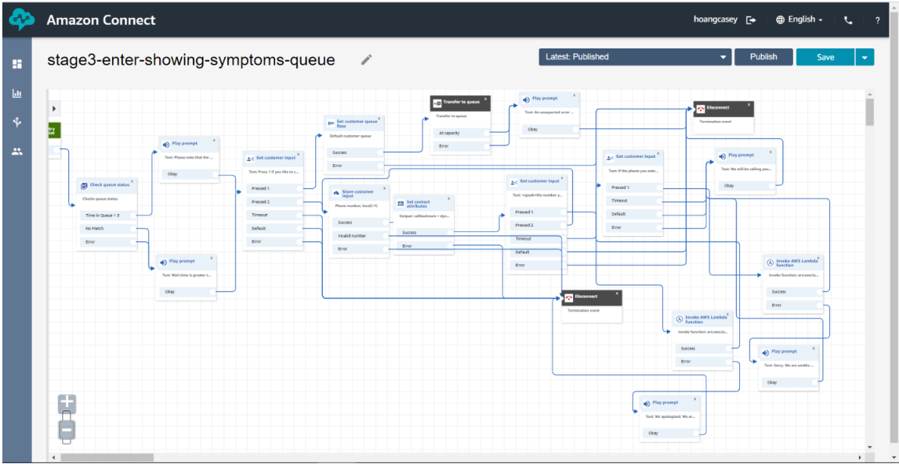

# Building an extension to an existing call center to handle Covid-19 calls

# Phone number to call in: 1-628-268-2848
If you calling in and picked the tested positive option, enter the following MRN#. 
MRN    11111. 

# Background - Why I choose this topic

When I got this coding assignment, all I can think of the call center at my work place. Currently, when patients call our OBGYN clinic, for the first minute the prompt will be about Covid 19. At the end of the announcement it will ask patient to write down the Michigan Hospital covid-19 hotline number and to give this a call. I think a hospital this size should be able to tranfer patients to the hotline.
Most patients will wait in queue. I like for patient to have an option to go covid hotline so it will be handle more efficiently.
The covid-19 protocols is always changing. I usually spend a lot of time asking doctors or nurses, whether a patient should cancel, reschedule their appointments, while putting patient on hold. This process takes a long time.
I designed a BEGINNING version of this flow where patients would to not be on hold for 20 minutes to reach the call center and another 20 minutes before the clinic can make a decision.
This had been very exciting challenge for me. I learned a lot and know very well there are so much to learn about connect, aws, programming in general. To be able to use my job experience when designing this system make it real and interesting for me.
My focus on this project is when a call center that can handle a health pandemic like covid 19. This are some test scenarios that I used while developing this system.
Below is the flow of the call-center

Scenario 1

- Patient woke up with a fever. She is not feeling well. She has an appointment tomorrow. She will call our the clinic and to ask what she needs to do. When I get a call with this situation, a nurse will typically look into her chart and decide whether it is necessary for her to keep appoinment or it can wait till her after she get tested or her symptoms goes away. The ideal agent to answer this queue will be Nurse or Medical Assistant.

Scenario 2

1. REGION=us-east-1 -- Setup region where this application will be running from
2. FROM_EMAIL=chinhoang@gmail.com -- email address required when using SES (getProviderEmail lambda function)
3. CALL_API_FUNCTION=covid-19-call-center-dev-callapi -- this variable is when getcoviddata invoke lambda function to get the data from the public API

## DynamoDB - This application uses 2 tables

1.  provider_email
    - This table stores the MRN (5 digits ) of patients and the email of the provider. Sample data will have to be entered after table is created.
      mrn - "11111" email: "hoangcasey@gmail.com"
2.  callback_number_list
    - this table store the callback number provided by the caller. It will also insert a date and timestamp.

## Lambda Functions

1. getProviderEmail - This lambda function is invoke when caller choose the tested positive option. It will take MRN # provided by the patient and send an email the provider using SES.
2. insertCallbackNumber - This function is invoke when caller choose the showing symptoms option and would like a callback. This funciton will scan the table for the same call back number. If callback number exis, it will not be inserted. If it is not found, the phone number, will be inserted with date and time.
3. getCovidData - this is the function that will get the covide 19 data from covidtracking api and return the data to the flow.
4. callAPI - This function is invoke from getCovidData function. It will take it the state abbrevations passed by the getCovidData function and call the api. The api will return JSON data.
5. sendSNS - When invoke, it will take the call number parameter and send the caller a confirmation text using AWS SNS

## Amazon Lex

1. getpatientcovidprompt - This lex has 2 intents.
   i. Showing Symptoms intent - caller can say the symptoms (fever, running nose, shortness of breath, or say one.)
   ii. Tested_Positive intent - caller can say getting positive, or tested positive or say 2

## Public API

1. public api is https://covidtracking.com/api/states? - the COVID tracking project

## Other

1. SSML - read the callback number back to the patient
2. Passing variables into lambda functions
3. Getting return data from lambda function and able to announce it to caller.

### Incoming call - stage-1-entry-point

1.  Caller will be prompt to press 1 if she/he has covid related concern or stay on the line
2.  If caller did not pick option 1, call will be tranfer to a regular call center queue
3.  If caller pick the covid option, caller will be asked whether he/she an established patient for the Michigan health system.
4.  If caller did not press 1, she / he will be prompt to call their provider and call will terminate
5.  When the caller press 1, call will tranfers to stage-2-get-CovidDataByState queue

### Get Covid Data for State

1. In this queue, caller will be prompt to enter home Zipcode.
2. The system will then invoke the getcovidData function using the zipcode. It will then pass the zipcode into callAPI function where it get the data from the API.
3. Caller will be able to hear the total positive cases and total currently hospitalized in the chosen state.

### Established Patient Queue

1. When caller is transfer in this queue, caller will be prompt to either
   a. say the symptoms they are experiencing (fever, shortness of breath, running nose, coughing, or 1), and it will transfer to stage-3-enter-showing-symptoms-queue
   b. say tested positive if tested positive or 2 and , and call will be tranfer to stage-3-enter-tested-positive-queue

### Showing Symptoms Queue

1. When caller is showing symptoms, the system will prompt caller the wait time in queue is either less or more than 3 mins.
2. Caller can pick option one to enter queue where an agent will answer the call
3. If caller pick option 2 for a callback the following events occurs:
   - The caller will wil be prompt to enter a 10 digit phone numbers starting with area code
   - The system using SSMl will read the phone number back to caller.
   - Caller can press one to confirm or press 2 to re-enter the number.
   - If caller confirmed the number, the system will invoke insert callbacknum function - If function return an error, it will prompt caller to call again.
   - If insert is successful, caller will be prompt to press 1 if the device he/she using is a mobile phone and want a confirmation text. The system will invoke sendSNS function to send a text to the mobile device using AWS SNS.
   - Call will terminate

### Tested Positive Queue

1. When caller pick the tested positive option, it will go to this stage-3-Tested-positive-Queue where caller will be prompt to enter their 5 digits medical record number.
2. It will be then invoke "getProviderEmail" lambda function to send an email to the provider using AWS SES. .
3. Caller will be prompt that the provider will be contacting shortly. Call will terminate
4. If caller do not know the MRN, call be tranfer to an agent.

## My ideal finished product would be with these functions (with more time)

- lambda function to read the phone number caller use to call in.
- to find an API that will get the State using the zipcode provided.(not hardcoding it)
- A work flow to read the callbacknum table and send a message to the supervisor that the following patients are still waiting for callback anad allowing the manager to set max hours patient should be waiting.
- Send a reminder to agent/nurse when same pt called again
- A Confirmation to the clinic manager that the provider read the email.
- I would love to add Chinese speaking queue by using Polly, SSML. It will very exciting if I can make this happen.
-

## Things I learned the last few days:

This is my first coding assigment since 2004. I rediscovered my love in programming and designing system. Thank you for giving me this great opportunity.
I still find coding very exciting, challenging and frustrating at times. This few days reminded me how I was. Waking up thinking about the code and going to bed thinking about how to make the program better. There are a lot more I like to add to this project to make it more functional and efficient. With my full time job and 3 kids doing online school at home, I tried as hard as I can.
